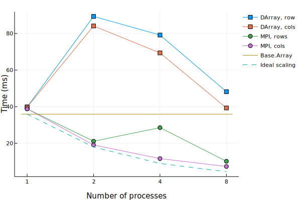

# MPIArrays

This package provides distributed arrays based on MPI one-sided communication primitives.
It is currently a proof-of-concept, only the functionality described in this readme is implemented
so far.

The following simple example shows how to multiply a matrix and a vector:

```julia
using MPI, MPIArrays

MPI.Init()
rank = MPI.Comm_rank(MPI.COMM_WORLD)
N = 30 # size of the matrix

# Create an uninitialized matrix and vector
x = MPIArray{Float64}(N)
A = MPIArray{Float64}(N,N)

# Set random values
forlocalpart!(rand!,x)
forlocalpart!(rand!,A)

# Make sure every process finished initializing the coefficients
sync(A, x)

b = A*x

# This will print on the first process, using slow element-by-element communication, but that's OK to print to screen
rank == 0 && println("Matvec result: $b")

# Clean up
free(A)
free(x)
MPI.Finalize()
```

## Construction

The constructors always create uninitialized arrays. In the most basic form, only the array size is needed as argument:

```julia
x = MPIArray{Int}(5,5)
```

This will distribute the first array dimension evenly over the number of processes in the `MPI.COMM_WORLD` communicator.

It is also possible to specify the number of partitions in each direction, e.g. to
create a 20 × 20 matrix with 2 partitions in each direction:

```julia
x = MPIArray{Int}(MPI.COMM_WORLD, (2,2), 20,20)
```

The above constructors automatically distribute the total number of elements in each direction in a uniform way. It is also possible to manually specify the number of elements in each partition in each direction:

```julia
x = MPIArray{Int}(MPI.COMM_WORLD, [7,3], [10])
```

This will create a 10 × 10 distributed array, with 7 rows on the first processor and 3 on the second.

Finally, a distributed array can be constructed from predefined local parts:

```julia
x = MPIArray{Int}([1,2,3], 4)
```

This will produce a distributed array with 4 partitions, each containing `[1,2,3]`

## Manipulation

The array interface is implemented, including normal indexing operations. Note that these lock and unlock the MPI window on each call, and are therefore expensive. The advantage of having these operations defined is mainly for convenient access to utility functions such as I/O.

Other supported operations from Base are `Base.A_mul_B!` for Matrix-vector product and `Base.filter` and `Base.filter!`

### Utility operations

A tuple containing the locally-owned index range can be obtained using `localindices`, with the rank as an optional argument to get the range on a rank other than the current rank. Calling `free` on an array will destroy the underlying MPI Window. This must be done manually, since there is no guarantee that garbage-collection will happen at the same time on all processes, so it is dangerous to place the collective call to destroy the window in a finalizer. To make all processes wait, call `sync` with one or more MPIArrays as argument. Currently this just calls `MPI.Barrier` on the array communicator.

### Accessing local data

Local data can be accessed using the `forlocalpart` function, which executes the function in the first argument on the local data of the array in the second argument, so it is compatible with the `do`-block syntax:

```julia
# Fill the local part with random numbers
forlocalpart!(rand!, A)

# Sum up the local part
localsum = forlocalpart(A) do lp
  result = zero(eltype(lp))
  for x in lp
    result += x
  end
  return result
end
```

### Redistributing data

Data can be redistributed among processes as follows:

```julia
# Initial tiled distribution over 4 processes:
A = MPIArray{Int}(comm, (2, 2), N, N)
# Non-uniform redistribution, with one column on the first processor and the rest on the last:
redistribute!(A, [N], [1,0,0,N-1])
# Restore equal distribution over the columns:
redistribute!(A)
```
See also `examples/redist.jl`.

## Blocks

The `Block` type helps in accessing off-processor data, since individual element access is too expensive. Blocks are created using the indexing operators using range arguments, e.g.:

```julia
Ablock = A[1:3, 2:6]
```

The block will not yet contain data, it just refers to the global index range `(1:3, 2:6)` and keeps track of the processes involved. To actually read the data, also allocating an array for the storage:

```julia
Amat = getblock(Ablock)
```

It's also possible to just allocate the matrix and fill it in a separate step:

```julia
Amat = allocate(Ablock)
getblock!(Amat, Ablock)
```

After modifying entries in an array associated with a block, the data can be sent back to the other processes:

```julia
Amat = allocate(Ablock)
rand!(Amat)
putblock!(Amat, Ablock)
```

### Global indexing on a block

Since a `Block` just refers to a regular Julia array, the indexing is local to the block. To index an array linked to a `Block` using the global indices of the underlying `MPIArray`, create a `GlobalBlock` like this:

```julia
gb = GlobalBlock(Amat, Ablock)
```

### Ghost nodes

A `GhostedBlock` allows periodic reading of off-processor data in arbitrary locations in the array. The `push!` method adds new indices, while `sort!` ensures that fetching the data (using `sync`) happens in the minimal number of MPI calls. The `getglobal` function gets an array value that is either part of the local data or a ghost, using its global array indices.

```julia
ghosted = GhostedBlock(A)
push!(ghosted, 1,1)
push!(ghosted, 3,2)
sort!(ghosted)
# Fetch off-processor data:
sync(ghosted)
# Show all ghosts:
@show ghosted
# Get an entry using its global indices, if part of the local data or ghosts:
@show getglobal(ghosted, 1, 1)
```

## Benchmark

As a simple test, the timings of a matrix-vector product were recorded for a range of processes and BLAS threads, and compared to the `Base.Array` and [DistributedArrays.jl](https://github.com/JuliaParallel/DistributedArrays.jl) performance. We also compared the effect of distributing either the rows or the columns. The code for the tests is in `tests/matmul_*.jl`. The results below are for a square matrix of size `N=15000`, using up to 8 machines with 2 Intel E5-2698 v4 CPUs, i.e. 32 cores per machine and using TCP over 10 Gbit ethernet between machines. Using `OPENBLAS_NUM_THREADS=1` and one MPI process per machine this yields the following timings:


The timings using one MPI process per machine and `OPENBLAS_NUM_THREADS=32` are:



For the single-threaded case, we also compare with the C++ library [Elemental](https://github.com/elemental/Elemental), using their unmodified [Gemv example](https://github.com/elemental/Elemental/blob/master/examples/blas_like/Gemv.cpp) with matrix size parameter 15000 and the same OpenBLAS as Julia.

Some observations:
1. Using a single process, both `DArray` and `MPIArray` perform at the same level as `Base.Array`, indicating that the overhead of the parallel structures that ultimately wrap a per-process array is negligible. This is reassuring, since just using parallel structures won't slow down the serial case and the code can be the same in all cases.
2. Without threading, the scaling breaks down even before multiple machines come into play. At 256 processes, there is even a severe breakdown of the performance. This may be because each process attempts to communicate with each off-machine process over TCP, rather than pooling the communications between machines. `DArray` seems to tolerate this better than MPI.
3. Using hybrid parallelism, where threads are used to communicate within each machine and MPI or Julia's native parallelism between machines is much faster. For MPI, the scaling is almost ideal with the number of machines, but for `DArray` the results are more erratic.
4. It is better to distribute the matrix columns, at least for this dense matrix matrix-vector product.
5. The `Base.Array` product with `OPENBLAS_NUM_THREADS=32` completes in about 40 ms, while the MPI version on 32 cores on the same machine completes in 18 ms. This suggests there is room for improvement in the threading implementation. On the other hand, the 32 MPI processes are no faster than 16 MPI processes on the same machine, indicating a possible memory bottleneck for this problem.
6. Even though the Julia implementation is quite simple, it compares favorably with a mature C++ library, with an apparent better scaling starting at 32 processes, though we did not investigate the cause of this and it may be possible to get better performance by tweaking Elemental settings.